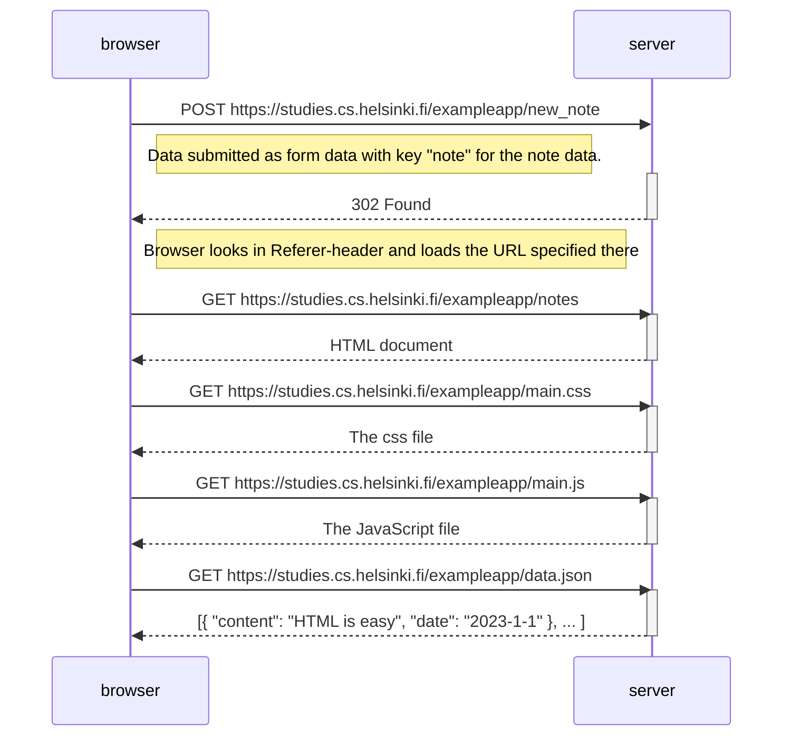
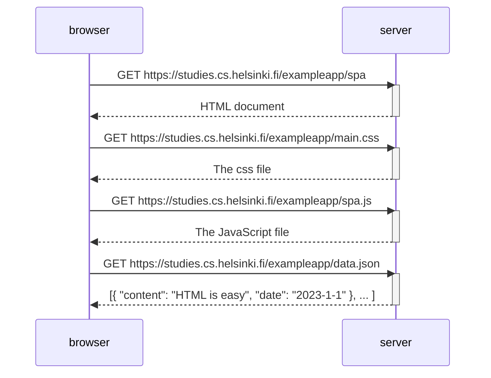
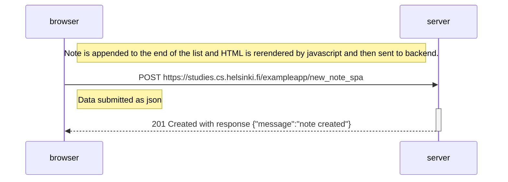

# Excerise 0.4

Assumes page is loaded as in the example diagram.

```mermaid
  sequenceDiagram
    participant browser
    participant server
   
    browser->>server: POST https://studies.cs.helsinki.fi/exampleapp/new_note
    Note right of browser: Data submitted as form data with key "note" for the note data.

    activate server
    server-->>browser: 302 Found
    deactivate server

    Note right of browser: Browser looks in Referer-header and loads the URL specified there

    browser->>server: GET https://studies.cs.helsinki.fi/exampleapp/notes
    activate server
    server-->>browser: HTML document
    deactivate server

    browser->>server: GET https://studies.cs.helsinki.fi/exampleapp/main.css
    activate server
    server-->>browser: The css file
    deactivate server

    browser->>server: GET https://studies.cs.helsinki.fi/exampleapp/main.js
    activate server
    server-->>browser: The JavaScript file
    deactivate server

    browser->>server: GET https://studies.cs.helsinki.fi/exampleapp/data.json
    activate server
    server-->>browser: [{ "content": "HTML is easy", "date": "2023-1-1" }, ... ]
    deactivate server

```

# Excerise 0.5

This is basicly the same as the example, just another javascript file.

```mermaid
  sequenceDiagram
    participant browser
    participant server

   browser->>server: GET https://studies.cs.helsinki.fi/exampleapp/spa
    activate server
    server-->>browser: HTML document
    deactivate server

    browser->>server: GET https://studies.cs.helsinki.fi/exampleapp/main.css
    activate server
    server-->>browser: The css file
    deactivate server

    browser->>server: GET https://studies.cs.helsinki.fi/exampleapp/spa.js
    activate server
    server-->>browser: The JavaScript file
    deactivate server

    browser->>server: GET https://studies.cs.helsinki.fi/exampleapp/data.json
    activate server
    server-->>browser: [{ "content": "HTML is easy", "date": "2023-1-1" }, ... ]
    deactivate server
 

```

# Excerise 0.6

```mermaid
  sequenceDiagram
    participant browser
    participant server

    Note right of browser: Note is appended to the end of the list and HTML is rerendered by javascript and then sent to backend.

    browser->>server: POST https://studies.cs.helsinki.fi/exampleapp/new_note_spa
    Note right of browser: Data submitted as json
    activate server
    server-->>browser: 201 Created with response {"message":"note created"}
    deactivate server

```